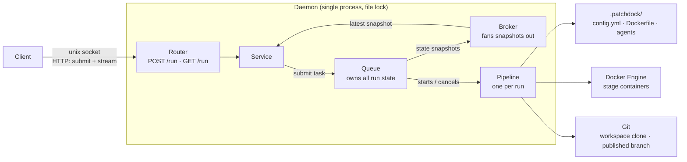
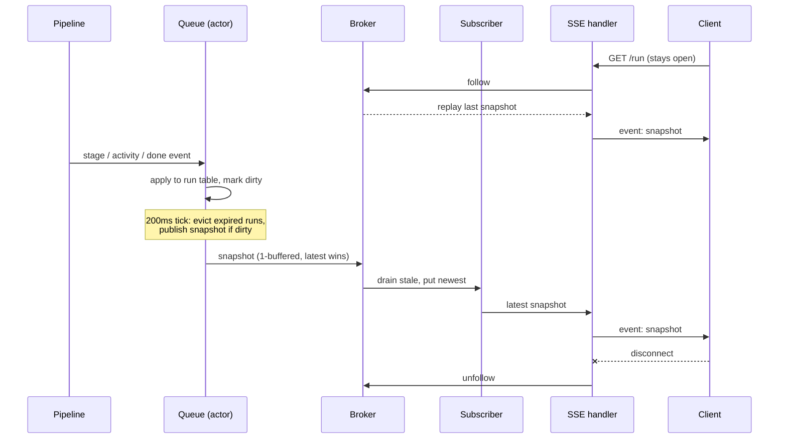
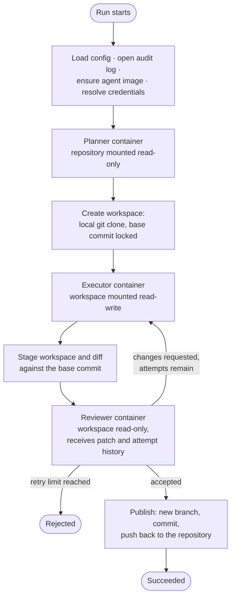

# Architecture

This document describes in detail how Patchdock works: how clients talk to
the daemon, how the daemon manages run state and streams it back live, and
what happens inside a single pipeline run.

## Overall structure

Clients talk to the daemon over a unix socket in the Patchdock runtime
directory. The daemon is the only long-lived process: it holds the run queue,
all live run state, and the connection to the Docker Engine. A file lock
guarantees a single daemon instance per machine.

Submitting a task is one HTTP request over the socket; following runs is one
long-lived streaming request. Building images, running stage containers,
cloning workspaces, and publishing branches all happen inside the daemon.

The daemon reads each repository's `.patchdock/` directory at run time: the
configuration, Dockerfile, and agent files are owned by the repository, not
by the daemon.

## Daemon and the SSE process

### State feed

Patchdock streams *state*. The daemon does not keep a history of
everything that happened; it keeps the current state of every run and
publishes a full snapshot whenever something changes. Clients therefore need
no backlog: a client that connects late, or briefly falls behind, receives
the latest snapshot and is immediately up to date. This is what makes the
rest of the design simple: every hop in the chain below only ever needs to
hold **one** snapshot, and newer replaces older.

### The queue

A single goroutine owns the entire run table. All communication goes through
a buffered inbox channel of typed events: submit, cancel, stage change,
activity, summary, done. Submitting is a request/reply event, where the
caller sends the task with a reply channel and blocks until the queue assigns
a run ID.

Because one goroutine serialises every mutation, there are no locks and no
data races by construction. Pipeline goroutines report progress by sending
events into the same inbox.

The queue publishes changes on a fixed 200ms tick: each
mutation only marks the state dirty, and the ticker clones the run table
into an immutable snapshot when the dirty flag is set. This coalesces bursts
of container activity into a bounded publish rate. The same tick also evicts
runs that have been finished for longer than the retention window,
so the daemon's memory does not grow with history.

### Broker and subscribers

The queue pushes snapshots into a single one-buffered channel using a
drain-then-put pattern: before sending, it removes any snapshot still
sitting in the buffer. The channel therefore always holds the *latest*
snapshot, and a slow reader can never apply backpressure to the queue.

The broker reads from that channel and fans each snapshot out to every
connected subscriber. Each subscriber is again a one-buffered channel, so a
stalled client only skips intermediate snapshots. The broker also remembers
the last snapshot and replays it to every new subscriber, so a freshly
connected client renders immediately instead of waiting for the next change.

### From snapshot to the terminal

A client opens `GET /run` and keeps the connection open. The handler
subscribes to the broker and writes each snapshot as a Server-Sent Events
frame (`event: snapshot` with a JSON payload), flushing after every frame.
Errors after the stream has started are sent in-band as `event: error`
frames, since the HTTP status line is long gone. When the client disconnects,
the request context is cancelled and the handler unsubscribes.

The end-to-end guarantee is intentionally weak and cheap: every client
eventually renders the current state, no client can slow down the daemon,
and the cost of a disconnect is zero, since there is no cursor, no
acknowledgement, and nothing to resume.

## Anatomy of a pipeline run

When the queue starts a run, the daemon assembles everything the pipeline
needs from the repository's `.patchdock/` directory:

1. **Configuration**: `config.yml` is loaded fresh for every run, so edits
   apply without restarting the daemon.
2. **Audit log**: a per-run directory is created at
   `.patchdock/logs/<run-id>/` before anything executes.
3. **Agent image**: if the configured image tag does not exist yet, it is
   built from `.patchdock/Dockerfile` (with `logs/` excluded from the build
   context) and the build output is written to the audit log. Subsequent
   runs reuse the image.
4. **Credentials**: the read-only credential mounts and environment
   variables declared in the configuration are resolved against the host.

The pipeline then drives the three stages:

### Workspaces

Agents don't touch the user's repository directly. Before the executor runs,
the pipeline makes a local git clone of the repository into a temporary
workspace and records the `HEAD` commit as the base. The executor edits the
workspace; after each attempt the pipeline stages everything and diffs
against the locked base commit, which yields the patch shown to the reviewer.

On acceptance, publishing happens *inside the workspace*: a new branch is
created from the changes, committed, and pushed back. Because the
workspace is a local clone, its `origin` is the user's repository, so the
push lands the branch there without ever touching the user's working tree
or checked-out branch. The temporary workspace is deleted when the run ends,
whatever the outcome; the only durable artifacts are the published branch
and the audit log.

### Mounts

Each stage runs in a fresh container from the repository's agent image. The
pipeline communicates with the container exclusively through the filesystem:
it writes `input.json` into a per-stage exchange directory, the agent writes
`output.json` back, and the container's stdout is streamed as structured
events into the audit log and the live activity feed.

| Mount | Container path | Mode | Stages |
| --- | --- | --- | --- |
| Per-stage exchange directory | `/io` | read-write | all |
| Repository's `.patchdock/` | `/agents` | read-only | all |
| User's repository | `/repo` | read-only | planner |
| Temporary workspace clone | `/workspace` | read-write | executor |
| Temporary workspace clone | `/workspace` | read-only | reviewer |
| Credential paths from `config.yml` | configured target | read-only | all |

The mount set encodes the trust model: the planner may read the real
repository but cannot change it; the executor may only change the disposable
workspace clone; the reviewer can inspect the changed workspace but not
tamper with it. Mount targets are checked for collisions, and credential
environment variables may not shadow the reserved `PATCHDOCK_*` variables
the runtime injects (stage name, run ID, agent file, token budget, attempt
counters).

### Audit log

Every run leaves a self-contained record in `.patchdock/logs/<run-id>/`:

| File | Content |
| --- | --- |
| `stdout.log` | Raw streamed output from every container, including image builds. |
| `run.json` | Machine-readable record of the run: plan, attempts, reviews, patch stats, outcome. |
| `run.md` | Human-readable summary rendered from the same record. |

The record is written when the run finishes, including on failure and
cancellation, so a run can always be reconstructed after the containers,
workspace, and daemon state are gone.
