# patchdock

Patchdock is a local control plane for running a planner, executor, and reviewer
against a repository in isolated Docker containers. Client applications submit
work to one daemon, which owns run state and the execution pipeline.

## Architecture

```mermaid
flowchart LR
    subgraph clients["Client applications"]
        CLI["dock CLI and TUI"]
        MCP["MCP server<br/>client adapter"]
    end

    subgraph daemon["Patchdock daemon process"]
        Lifecycle["daemon lifecycle"]
        Socket["Unix socket<br/>HTTP/JSON + SSE"]
        API["daemon API and service"]
        Queue["run queue and state"]
        Broker["snapshot broker"]
        Runner["pipeline runner"]

        Lifecycle --> Socket
        Socket --> API
        API --> Queue
        Queue --> Runner
        Queue --> Broker
        Broker -->|"live snapshots"| API
    end

    subgraph execution["Per-run execution"]
        Config["config package<br/>.patchdock/config.yml"]
        Pipeline["pipeline package"]
        Planner["planner stage"]
        Executor["executor stage"]
        Reviewer["reviewer stage"]
        Workspace["temporary Git workspace"]
        Audit["audit logs and patch artifacts"]

        Config -->|"stages, limits, retries"| Pipeline
        Pipeline --> Planner
        Planner --> Executor
        Executor --> Reviewer
        Reviewer -->|"changes requested"| Executor
        Pipeline --> Workspace
        Pipeline --> Audit
    end

    Docker["Docker Engine<br/>isolated agent containers"]
    Repo["target repository<br/>.patchdock/"]

    CLI -->|"submit and watch"| Socket
    MCP -->|"same local API"| Socket
    CLI -.->|"starts on demand"| Lifecycle
    Runner --> Config
    Runner --> Pipeline
    Pipeline -.->|"stage and activity reports"| Queue
    Planner --> Docker
    Executor --> Docker
    Reviewer --> Docker
    Repo --> Config
    Repo --> Workspace
    Planner --> Audit
    Executor --> Audit
    Reviewer --> Audit
```

The CLI is the implemented client in this repository. The MCP server is shown
as an adapter at the same boundary: it should use the daemon's local API instead
of invoking the pipeline or Docker directly. The daemon loads repository
configuration, queues each run, executes the pipeline, and streams live state
back to connected clients.

## Commands

| Command | What it does |
| --- | --- |
| `dock init` | Scaffold `.patchdock/` in the current repo: config, starter agents, Dockerfile. |
| `dock` | Full-screen view of every run across every repo. Read-only — quitting never stops a run. |
| `dock run -p "<prompt>"` | Queue a run in the current repo and attach to it. |
| `dock run` | Open the repo-scoped view with a prompt input, then attach to what you submit. |
| `dock run -d -p "<prompt>"` | Queue and exit, printing the `run_id`. |
| `dock watch` | Same view as `dock`. |
| `dock watch <run-id>` | Open focused on a single run — the way back after detaching. |
| `dock cancel <run-id>` | Cancel a queued or running run. |
| `dock daemon status` | Daemon health: uptime, version, queue depth, running count, Docker reachability. |
| `dock daemon stop` | Drain and stop the daemon. |
| `dock daemon run` | Run the daemon in the foreground, for debugging. |

### `dock run` flags

| Flag | Meaning |
| --- | --- |
| `-p, --prompt` | The task. Without it, `dock run` opens an input. |
| `-d, --detach` | Queue and exit instead of attaching. |
| `--repo <path>` | Target a repo other than the current directory. |

### Behaviour worth knowing

- Every command routes through the daemon's queue. `dock run` with and without `-d`
  differ only in whether the CLI stays attached.
- Any client starts the daemon on demand — except `dock daemon status`, which reports
  that none is running rather than starting one.
- Ctrl-C while attached detaches; the run keeps going. Stop it with `dock cancel`.
- Evidence for a run lands in `.patchdock/logs/<run-id>/`.
- Commands that need a terminal print help instead when stdout is redirected.
