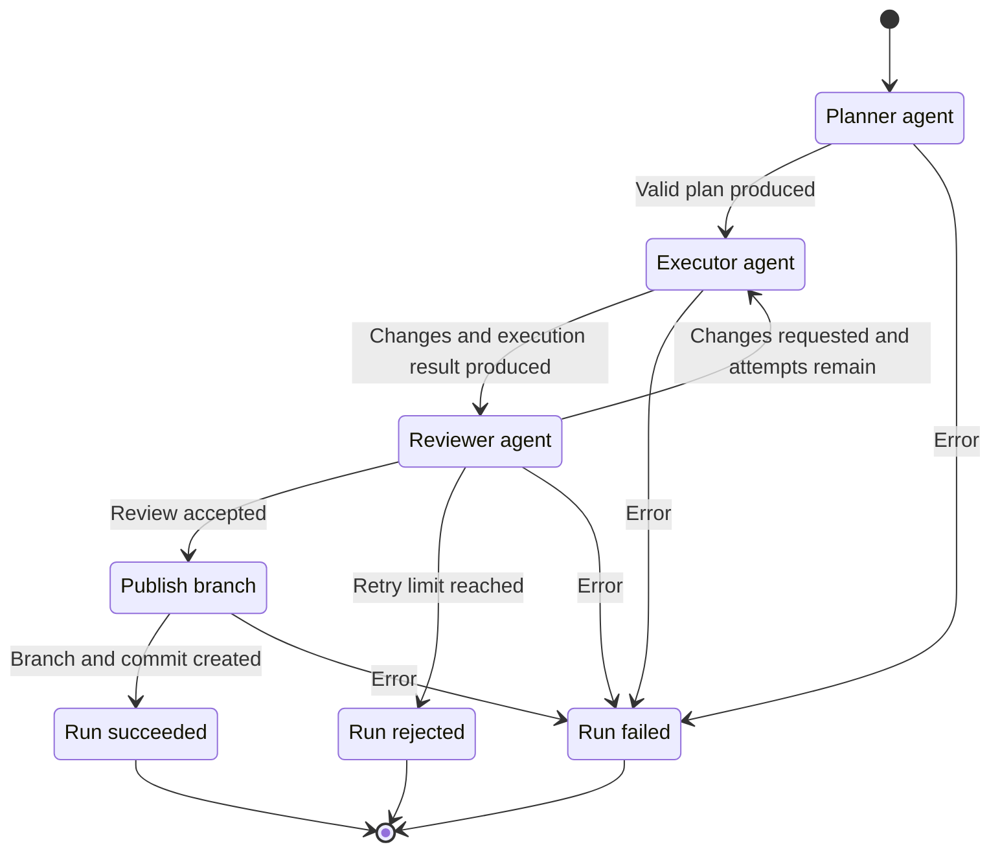

# Patchdock

Turns a prompt into a reviewed patch. Describe a task, and agents
work through it inside an isolated Docker container; the result lands as a
commit on a `patchdock/…` branch in your repository, ready to review and merge.


## Getting started

> [!NOTE]
> Patchdock is not yet distributed through Homebrew or npm. Distribution will
> be added after critical work is complete, including Docker runtime
> hardening, cancellation support, and daemon lifecycle improvements.

Building Patchdock requires Go; running it requires a Docker Engine. Install
the `dock` binary from source:

```bash
git clone https://github.com/HJyup/patchdock.git
cd patchdock
go install ./cmd/dock
```

Make sure the Go binary directory is on your `PATH`:

```bash
export PATH="$(go env GOPATH)/bin:$PATH"
```

Then initialise the repository you want agents to work on:

```bash
cd your-repo
dock init
```

This creates a `.patchdock/` directory with the configuration and agent
definitions Patchdock uses during execution:

```text
.patchdock/
├── config.yml
├── Dockerfile
├── planner.ts
├── executor.ts
└── reviewer.ts
```

Adapt the Dockerfile to your repository's toolchain, then open Patchdock and
submit your first task:

```bash
dock
```

## CLI reference

| Command | Description |
| --- | --- |
| `dock init` | Create the repository's `.patchdock/` directory. Add `--force` to regenerate it, overwriting the existing configuration and agent files. |
| `dock` | Open the interactive terminal interface on the task input. Submit tasks there and switch to the live dashboard to follow runs across repositories. |
| `dock watch` | Open the terminal interface directly on the live dashboard. |
| `dock "<prompt>"` | Queue the task, print its run ID, and exit without opening the terminal interface. Starts the daemon on demand. |
| `dock --repo <path> "<prompt>"` | Queue the task against another repository instead of the current directory. |
| `dock cancel <run-id>` | Cancel a queued or running run from any terminal. The run stops at its current stage and its container is removed. |
| `dock daemon status` | Show daemon health, uptime, process ID, socket, and log path. |
| `dock daemon run` | Run the daemon in the foreground for debugging. |
| `dock daemon stop` | Signal the running daemon to stop and wait for it to exit. |

The daemon owns the run queue, Docker execution, and live state. Clients start
it automatically when needed; the `dock daemon` commands let you inspect or
control it directly.

## Configuration

### Dockerfile

Each repository owns a `.patchdock/Dockerfile`. It defines the isolated
environment in which the planner, executor, and reviewer operate.

Add everything the agents need to build, test, and inspect the repository:
language runtimes, package managers, compilers, system libraries, project tools,
and prewarmed dependencies. These additions become part of the agent image and
are available during every stage.

### config.yml

The repository's `.patchdock/config.yml` defines the execution guardrails for
its agents. For example:

```yaml
container:
  timeout: 10m
  token_budget: 100000

retries:
  max: 3
```

The container timeout is a hard wall-clock limit for each stage. The token
budget is passed to the agent as an advisory budget, while the retry limit
controls how many executor and reviewer rounds may run. The configuration also
selects stage files, declares read-only credential mounts, names the reusable
agent image, and controls the Git branch prefix.

## Patchdock Agent SDK

The TypeScript files in `.patchdock/` use `@patchdock/sdk` to define typed
planner, executor, and reviewer contracts. Each stage file decides how its
agent is driven inside the container.

### Supported agents

The table below lists the coding agents that can run inside the container:

| Agent | Status |
| --- | --- |
| Codex | Supported |
| Claude | Coming soon |

For agent contracts, custom implementations, runtime context, and configuration
details, read the [Patchdock Agent SDK documentation](./sdk/README.md).

## How it works

The `dock` CLI talks to a local daemon over a unix socket. The daemon queues
runs, drives Docker execution, and streams live state back to the clients.

Every task moves through three agents: the planner produces a plan, the
executor applies it to the repository, and the reviewer judges the changes.
A rejected review sends the task back to the executor until the configured
retry limit is reached; an accepted review is published as a branch and
commit.



## References

- [Architecture](./ARCHITECTURE.md)
- [Patchdock Agent SDK](./sdk/README.md)
